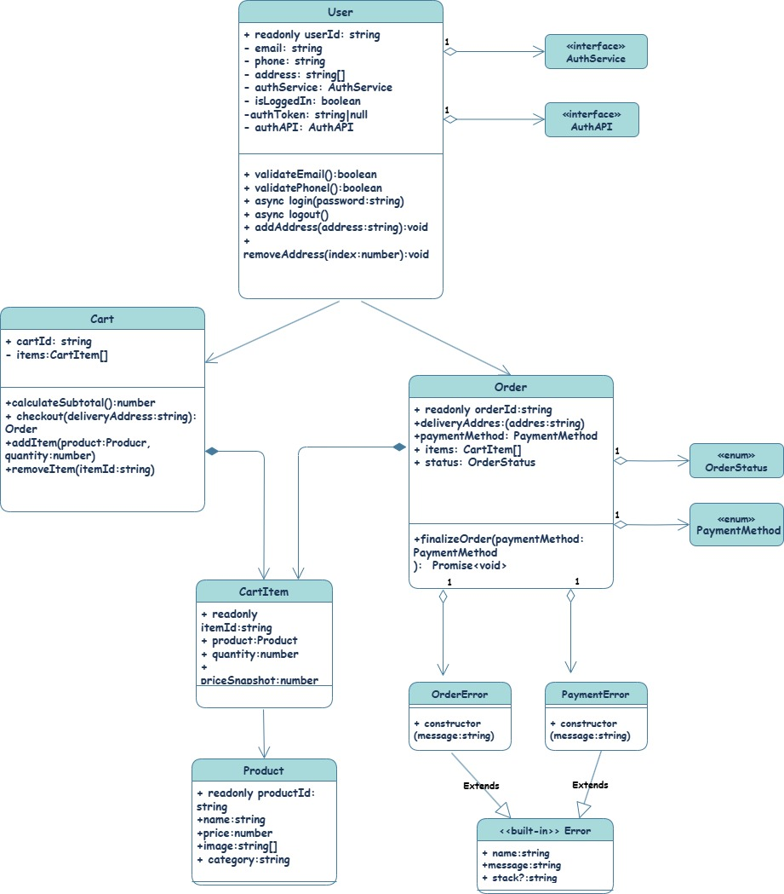

# Проектная работа "Веб-ларек"

Стек: HTML, SCSS, TS, Webpack

Структура проекта:
- src/ — исходные файлы проекта
- src/components/ — папка с JS компонентами
- src/components/base/ — папка с базовым кодом

Важные файлы:
- src/pages/index.html — HTML-файл главной страницы
- src/types/index.ts — файл с типами
- src/index.ts — точка входа приложения
- src/scss/styles.scss — корневой файл стилей
- src/utils/constants.ts — файл с константами
- src/utils/utils.ts — файл с утилитами

## Установка и запуск
Для установки и запуска проекта необходимо выполнить команды

```
npm install
npm run start
```

или

```
yarn
yarn start
```
## Сборка

```
npm run build
```

или

```
yarn build
```
## Архитектура


1. Класс User
Реализует управление данными пользователя и авторизацию его. Содержит id, email, номер, адрес пользователя. 
Класс имеет такие методы: 
* validateEmail, validatePhone - для проверки валидности email и номера телефона
* login(password:string) - аутентификация пользователя
* logout() - завершает сеанс пользователя
* addAddress(addres:Addres), removeAddres(addresId:string) - для добавления и удаления адреса пользователя.

2. Класс Cart
 Реализует управление корзиной покупок. Содержит список товаров.
 Класс имеет такие методы:
 * calculateSubtotal() - для подсчета общей стоимости товаров
 * checkout() - для перевода корзины в статус "оформлено"
 * addItem(product: Product, quantity: number) - для добавления товара в корзину
 * removeItem(itemId: string) - для удаления товара из корзины.

3. Класс Order
Реализует оформление и управление заказов пользователя. Содержит id заказа, адрес доставки, способ оплаты? статус заказа.
Имеет метод finalizeOrder(), для выполнения завершающих действий для выполнения заказа.

4. Класс OrderError
Является исключением, возникающим при ошибках, связанных с обработкой заказов. Содержит поля name(тип ошибки) и message(описание).
Поддерживает стек вызовов (stack) для отладки.

5. Класс PaymentError
Является исключением, возникающим при ошибках, связанных с платежами. Содержит поля name(тип ошибки) и message(описание).
Поддерживает стек вызовов (stack) для отладки.

